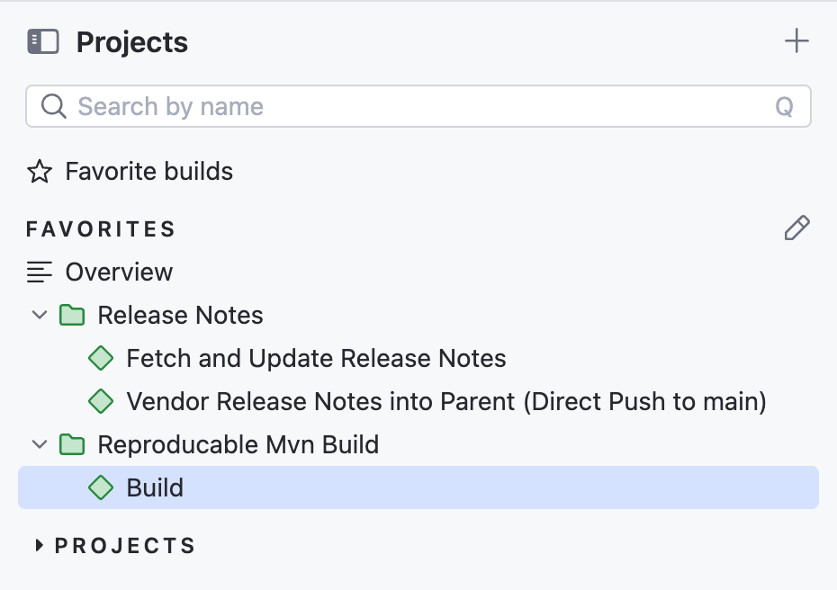

# Assignment Solution — Reproducible Maven Build

The solution to the assignment is as follows:
It involves 2 repositories as mentioned below

## Repositories
- Parent repo (reproducible build):  
  https://github.com/Varshraghu98/reproducable-mvn-build
- Release notes repo:  
  https://github.com/Varshraghu98/release-notes

## TeamCity CI Jobs Setup
The TeamCity setup consists of the following jobs:
### 1. Fetch Release Notes
- Fetches the latest release notes from the marketing URL.
- Creates a manifest file with fetch details and the SHA256 of the release notes.
- Commits the fetched file into the release-notes repo:  
  https://github.com/Varshraghu98/release-notes
- Produces an artifact `notes-sha.txt` containing the latest commit SHA of the release-notes repo.
- The Kotlin DSL for this job can be found at: https://github.com/Varshraghu98/release-notes/tree/main/.teamcity
- The buildscript used by this job is : https://github.com/Varshraghu98/release-notes/blob/main/fetchReleaseNotes.sh

**Note:** For demonstration purposes, the marketing URL is:  
https://downloads.mysql.com/docs/mysql-9.0-relnotes-en.pdf

### 2. Vendor Release Notes
- Depends on the Fetch job.
- Reads the `notes-sha.txt` artifact to obtain the commit SHA of the release-notes repo.
- Checks out that commit from the release-notes repo.
- Syncs the latest release notes and manifest file into the parent repo.
- The parent repo now contains the updated release notes.
- The Kotlin DSL for this job can be found at: https://github.com/Varshraghu98/release-notes/tree/main/.teamcity
- The buildscript used by this job is: https://github.com/Varshraghu98/reproducable-mvn-build/blob/main/buildscripts/vendor-release-notes.sh

**Note:** Fetch + Vendoring are manual jobs that developers can run when they want to update to the latest release notes.

### 3. Reproducible Maven Build
- The main reproducible build job.
- Checks out the parent repo at the specified commit (`env.commitHash`).
    - If not set, it defaults to the latest commit on the branch.
- Runs the Maven build to produce a deterministic archive.
- The generated `.zip` file includes:
    - Javadocs
    - Vendored release notes
    - Manifest file (with provenance details)
- The SHA256 hash of the ZIP is calculated and printed in the build logs for verification.
- The Kotlin dsl setting of this job can be found at : https://github.com/Varshraghu98/reproducable-mvn-build/tree/main/.teamcity
- The build scripts used by this job is: https://github.com/Varshraghu98/reproducable-mvn-build/tree/main/buildscripts

## Outcome

- The `.zip` artifact is **byte-for-byte reproducible** when built from the same commit.
- Only the **commit hash** is required as input to reproduce the artifact.
- Verification can be done by comparing the SHA256 values of builds from the same commit.

## Teamcity Server and Agent Setup Details
- The details on how to run the docker-compose deployment is outlined here : https://github.com/Varshraghu98/teamcity-deployment
- Once the required dsl is loaded from VCS the jobs structure will look like 

